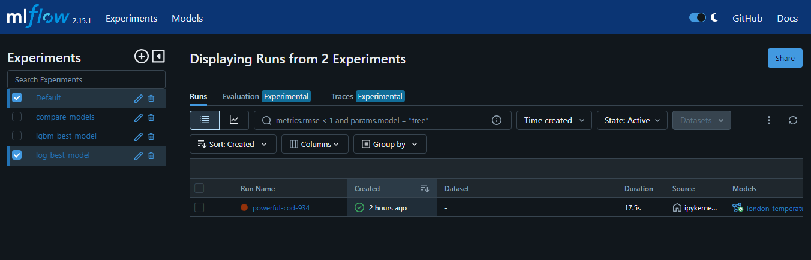
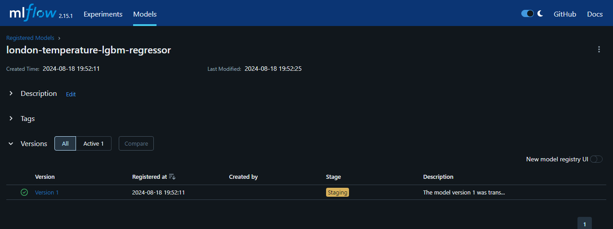
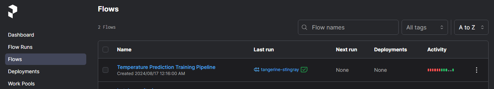
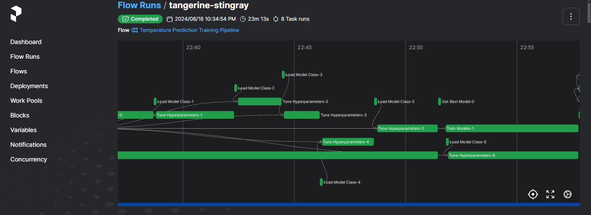
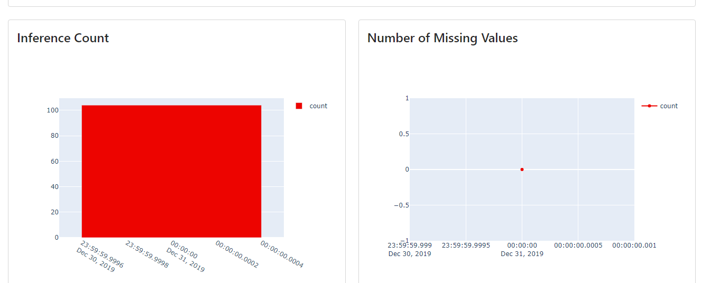
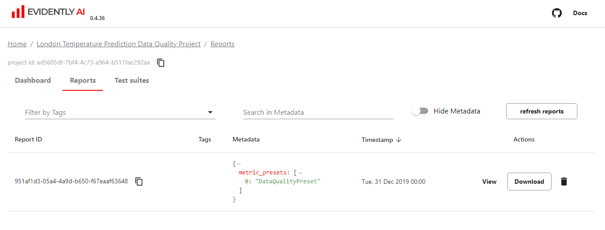
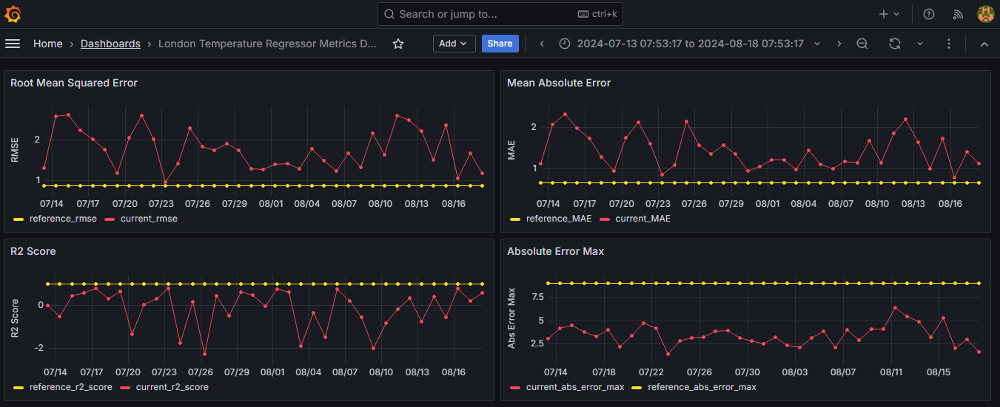

## <ins>Temperature prediction in London</ins>
This is an end to end project to implement a machine learning operations pipeline that predicts the mean temperature in London on a given date based on important weather parameters gathered by European Climate Assessment & Dataset project. This project is implemented using MLflow, Prefect, Amazon Web Services (EC2, S3, IAM), Docker, Jupyter Notebook, Flask, Docker, Evidently and Grafana. 

## Description 

### Problem
The mean temperature at a location has a close connection to climate change and has a wide-ranging impact on the environment, society and global economies. The global mean temperatures have been steadily increasing due to the emission of green house gases. Human kind is increasingly exposed to extreme weather events like heatwaves, hurricanes and flooding. The rising sea levels can lead to habitat loss. Elevated temperatures worsen air quality thereby posing a serious health hazard to vulnerable populations. Increased temperatures have a profound effect on agricultural productivity and can lead to water scarcity stressing out the natutal and man made water resources. This project aims at creating models that can predict the mean temperature accurately such that proactive measures can be undertaken to maintain proper balance between environment, agricultural demands, energy management and health and safety sectors.

### Objective
This project creates a machine learning (ML) operations pipeline that will use the weather data to predict mean temperature in London. Several ML models will be run on this data and the experiment will be tracked using MLflow and best model logged into MLflow Registry. The best model’s artifacts will be stored on AWS S3 and accessed inside a Flask application as a web service to make the mean temperature predictions. The entire pipeline from data preparation, feature engineering, model training, hyper parameter tuning to model tracking and storage will be orchestrated using Prefect. For monitoring the performance of the model on new weather data, Evidently AI and Grafana tools are used.

### Dataset
The data for this project is downloaded from [Kaggle](https://www.kaggle.com/datasets/emmanuelfwerr/london-weather-data) . The dataset is created by “European Climate Assessment & Dataset project” and has around 15K records for the time period from 1979 to 2021. The data is captured daily. The data card on the above link can be obtained from the above link.

### Tools and Technologies Used

Cloud – [Amazon Web Services](https://aws.amazon.com/)  
Virtual machine – [Amazon EC2](https://ec2.amazon.com/)  
Containerization – [Docker and Docker Compose](https://www.docker.com/)  
Orchestration – [Prefect](https://www.prefect.io/)  
Experiment tracking and ML model management – [Mlflow](https://mlflow.org/)  
Model artifacts storage – [Amazon S3](https://aws.amazon.com/s3/)  
Model deployment – [Flask](https://flask.palletsprojects.com/en/3.0.x/)  
Model monitoring – [Evidently AI](https://www.evidentlyai.com/)  
Model metrics visualisation - [Grafana](https://grafana.com/)  
Language – [Python](https://www.python.org/)  
Notebooks – [Jupyter](https://jupyter.org/)  

### Architecture

### Exploratory Data Analysis
In this step, the downloaded temperature dataset was analyzed for missing values and outliers. Data distribution, Time series and Principal Component Analysis were done to understand the correlation between the various weather parameters. The charts were plotted using Matplotlib and Seaborn. The outputs are captured in the following EDA [notebook](eda/eda-temperature.ipynb).

### ML modeling
In this step, the temperature data was modeled using several ML techniques. LazyPredict Python package was used to run all available regression models on the data and the top regressors with the best RMSE and runtime were further evaluated in the Prefect orchestration pipeline. The outputs are captured in the following modeling [notebook](model-training/predict_mean_temp.ipynb).

### Experiment Tracking
In this step, MLflow was used to run the data against the selected models from the modeling phase and Hyperopt Python package was used to derive the best hyperparameters for these models. The experiements were logged into MLflow and the best model from among the several experiments run, was registered in the MLflow model registry. The outputs are captured in the following modeling notebooks [Tracking](experiment-tracking/track_experiments.ipynb) and [Model registry](experiment-tracking/register-model.ipynb). MLflow UI can be invoked by issuing the following command from the experiment_tracking folder.

```
mlflow ui --backend-store-uri sqlite:///mlflow.db
```
  



### Training Pipeline
Prefect is used to run an end to end pipeline that includes data preparation, feature engineering, model training, hyperparameter selection , model tracking and model registry and export of artifacts to Amazon S3. Once the pipeline runs, the flows and the corresponding flow runs can be monitored using the Prefect UI. Below are the successful screnshots of running the pipeline.

  


 


### Deployment
After the training pipeline is run, we will deploy the model as a web service using flask application run within a Docker container. gunicorn is used as the server for running the Flask application on the production server. The LGBM regressor model artifacts are extracted from Amazon S3 bucket and the new json record with weather features are fed to the web service to get the predicted mean temperature. The outputs are as shown below.

  


  

### Monitoring

Here we run the model on new set of weather data (from 2021 onwards). Weather data for the years 2021 - 2023 were extracted from the ECA website and merged together and used as the current data. The validation dataset from the original dataset is used as the reference data. Metrics are calculated for both reference and current data and plotted using Evidently and Grafana. The [notebook](eda/extract_new_data.ipynb) is used to generate the new current data from the raw data files stored in [raw_data](data/raw_data). The [new datasets](data)  and the reference [validation dataset](monitoring/data) can be found in the respective folders.

  

  

  


## Steps to run the project

### Prequisities
This project was run locally using a 4GM RAM WSL2 on Windows laptop. The project can also be run on AWS EC2 machine with an appropriate configuration. Refer [here]() for more instructions on how to setup the machine required to run this project.
