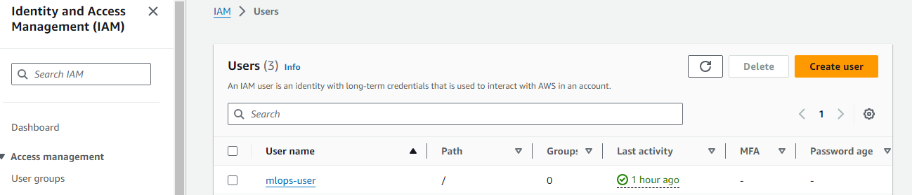
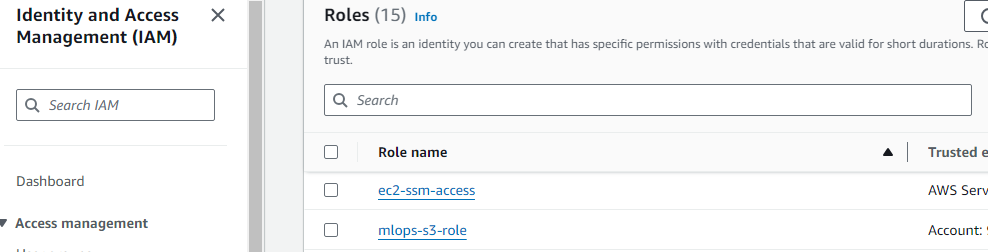
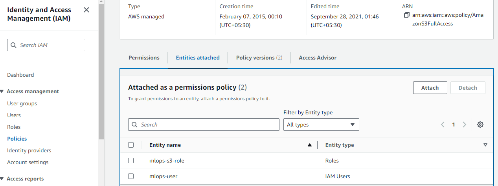
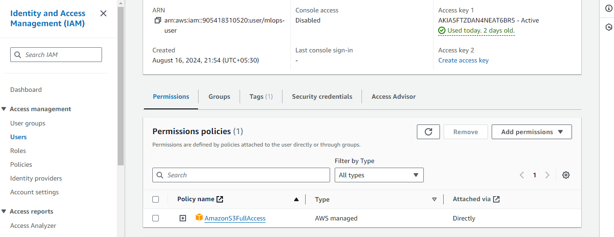

### AWS Account Setup (Free tier account)

Create an AWS account with your email. This email should be kept carefully and should not be used for AWS services for any project.

Using the administrator account, create an [IAM user](https://docs.aws.amazon.com/IAM/latest/UserGuide/id_users_create.html) and an [IAM role](https://docs.aws.amazon.com/IAM/latest/UserGuide/id_roles.html) with AdministratorAccess and AmazonS3FullAccess permissions. This user acts as the admin for the project and will be used to create the infrastructure. However when the infrastructure is created each service will have its own IAM role with the least required permissions.

Log in to AWS by using IAM user account created as above.

Create an [access key](https://docs.aws.amazon.com/IAM/latest/UserGuide/id_credentials_access-keys.html) for the user. This will give you the AWS_ACCESS_KEY and AWS_SECRET_ACCESS_KEY which you'll need to configure the [AWS CLI](https://docs.aws.amazon.com/cli/v1/userguide/cli-configure-files.html) later. Access keys are secret, just like a password. Don’t share them.

### EC2 virtual machine setup 

Refer to this [video](https://www.youtube.com/watch?v=IXSiYkP23zo) by Alexey for understanding on how to setup an SSH environment on the Amazon EC2 machine. You can then follow the below steps.

Launch a new EC2 instance. An Ubuntu OS (Ubuntu Server 24.04 LTS (HVM), SSD Volume Type, Architecture 64-bit (x86)) and a t2.large instance type, a 30Gb gp2 storage are recommended.

Note - Billing will start as soon as the instance is created and run.

Create a new key pair (access keys) so later you can connect to the new instance using SSH.

Save the .pem file in the ~/.ssh directory.

Create a config file in your .ssh folder

```
code ~/.ssh/config
```

Copy the following snippet and replace with External IP of the Virtual Machine. Username and path to the ssh private key
```
Host mlops-zoomcamp
    HostName <ec2_public_ip>
    User ubuntu
    IdentityFile ~/.ssh/<key_pair_name>.pem
    StrictHostKeyChecking no
```

Once you are setup, you can simply SSH into the servers using the below commands in separate terminals. Do not forget to change the IP address if VM restarts.

```
ssh mlops-zoomcamp
```

You will have to forward ports from your VM to your local machine for you to be able to see the respective tools UI locally. Check how to do that [here](https://www.youtube.com/watch?v=ae-CV2KfoN0&t=1074s).


Configure the AWS CLI using the command [aws configure](https://docs.aws.amazon.com/cli/latest/reference/configure/). You'll need to provide the AWS_ACCESS_KEY and AWS_SECRET_ACCESS_KEY along with the AWS_REGION and AWS_OUTPUT_FORMAT (optional, usually json).
AWS Access Key ID [None]: The access key id from IAM
AWS Secret Access Key [None]: The secret access key from IAM
default region name should be the similar format as: ap-south-1 

Find below a few screenshots on how the IAM user and role has been created.

  
  
  
  


