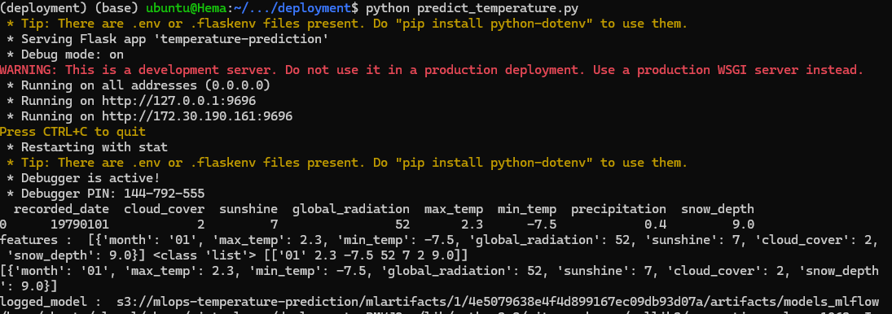
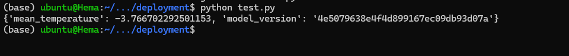

We will be using Flask application from inside a Docker container to run the model on new data. Currently the deployment is coded to handle one days's weather data at a time. The Flask application is called from a Docker container and it loads the model from Amazon S3 and runs the model on the json weather data.

Note: The Docker container is currently having a bug with credentials error. This will be work in progress to fix the error. However the web service can be interactively run to get the prediction on a json weather record by doing the following.
```
cd ~/mlops_temperature_prediction/deployment
pipenv shell
```

Start the Flask server by issuing the following command.
```
python predict_temperature.py
```

On another terminal, start a web service request to get the prediction.
```
python test.py
```
The outputs are as below.


