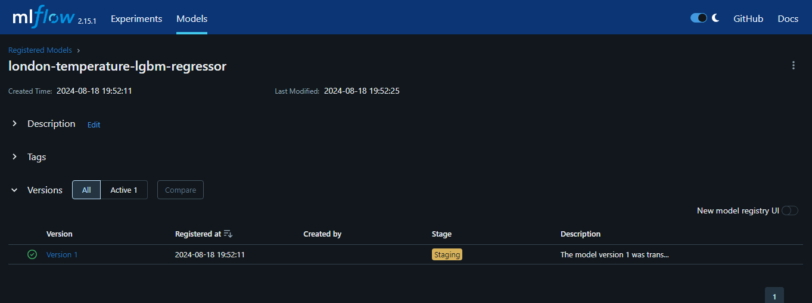

The EDA and Experiement Tracking notebooks can be run by going to the respective folders [eda](../eda) and [experiment-tracking](../experiment-tracking) and invoking the various notebooks using jupyter notebook. All the outputs will be captured inside the notebooks.

  
  

