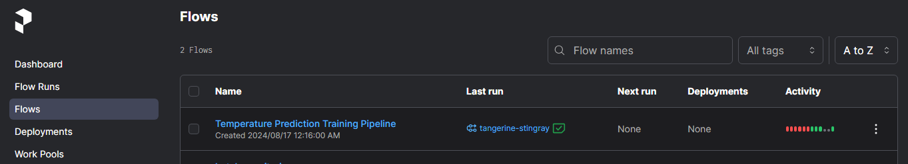

## Prefect with MLflow

DAG Flow -

- We load weather data from the Kaggle website.
- This data is split to training data and validation data and the features are vectorized.
- Five key ML models are evaluated to find the model which has the lowest RMSE in the validation data. LGBM regressor evolved as the best model. Hyperparameter tuning was done using the search space built by Hyperopt python package.
- The best model is then used to train on all data to be used in production.
- The dict vectorizer and best model are bundled into a pipeline and registered in the MLflow registry. All trained model artifacts are stored in AWS S3, identified by their run_id.
- The model deployed in Amazon S3 will be used in the deployment phase.

Change directory to training folder
```
cd orchestration/prefect/
```

Run the following to start the mlflow tracking server. This will track the MLflow experiements in the sqlite DB stored in the current working directory.

```
mlflow server --backend-store-uri sqlite:///mlflow.db
```

Run prefect server by issuing the following commands. 

```
prefect server start
```

There are 2 options to run training pipeline.

Option 1: Run the prefect flow below interactively from the folder [orchestration/prefect](../orchestration/prefect) (This is the option that I tested for). First create a prefect block to create a bucket in Amazon S3.
```
python orchestration/prefect/create_s3_bucket_block.py
python train_models.py
```

Option 2: Trigger Prefect flow

Change directory to main folder
```
cd ~/mlops_temperature_predictionm
```

Start the prefect worker

```
prefect worker start --pool temperature_prediction
```

Deploy the pipeline
```
prefect deploy training/train_models.py:main_flow -n temperature_prediction_flow -p temperature_prediction
```

Run the ML model training and model registration pipeline

```
prefect deployment run 'Train Model Pipeline/temperature_prediction_flow'
```

Below is the screenshot of the Prefect Deployment:

  
  
  


